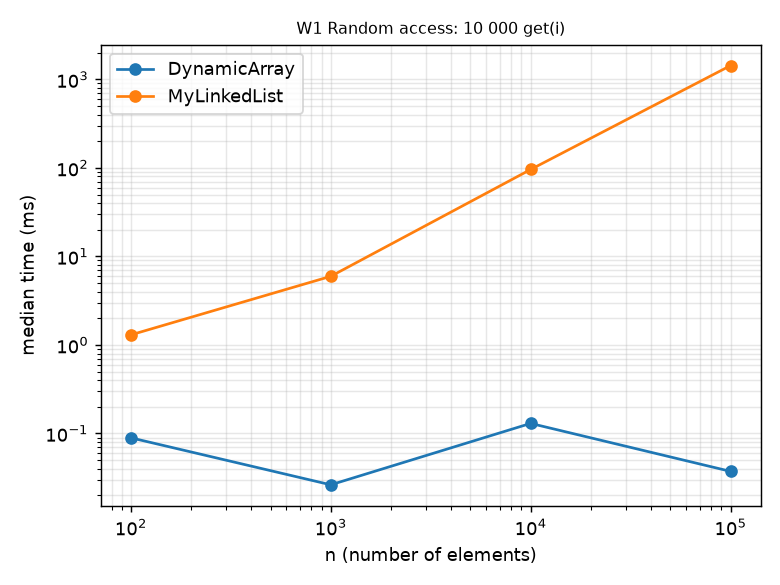
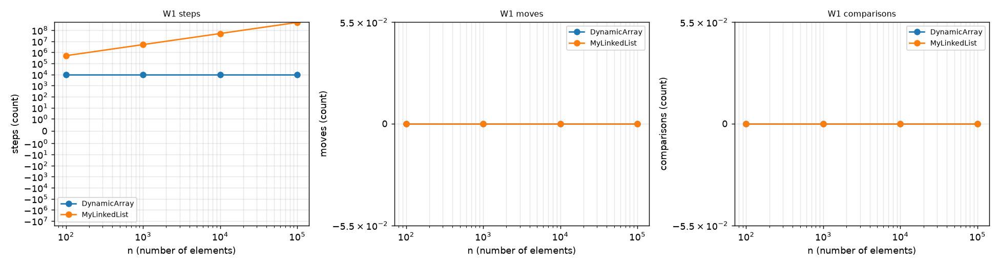
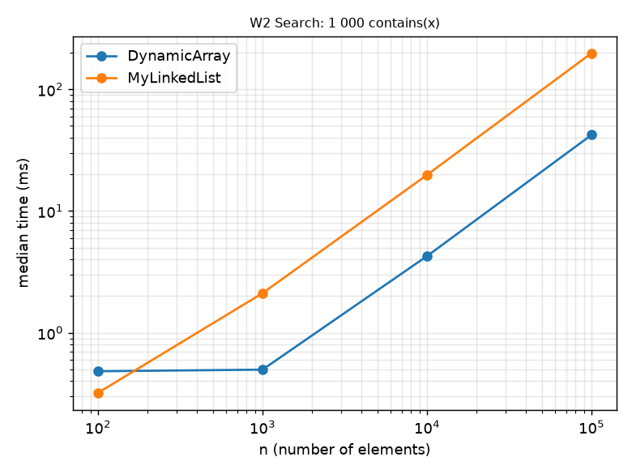
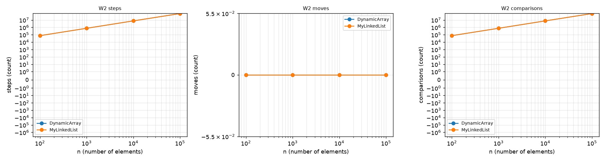
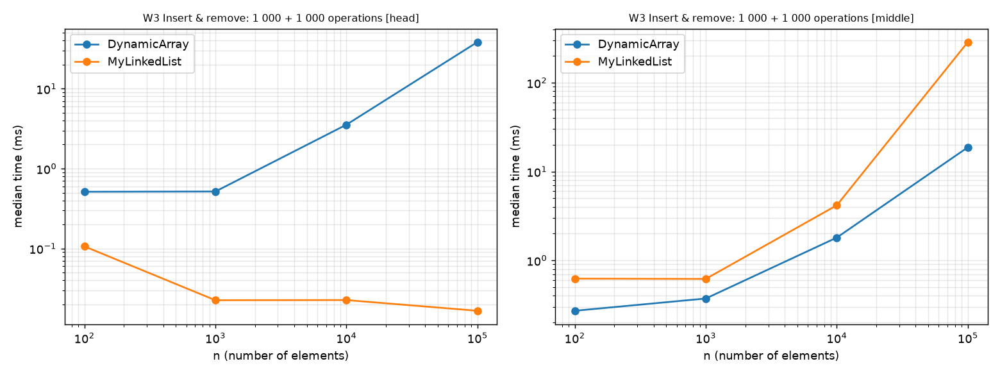
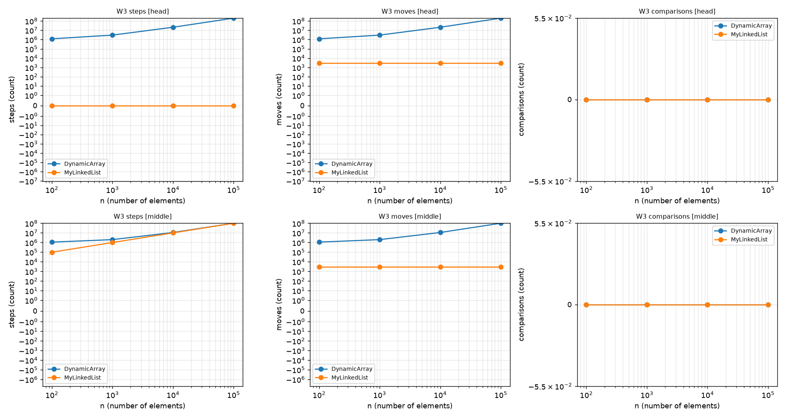
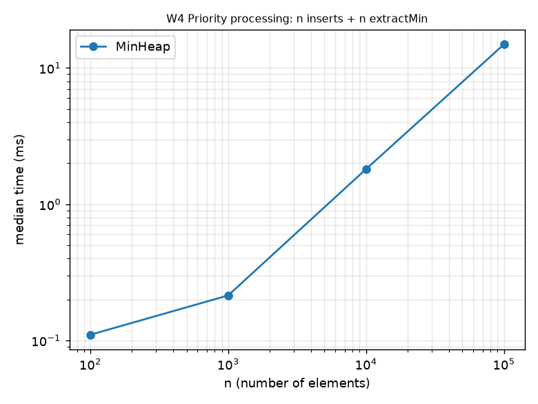
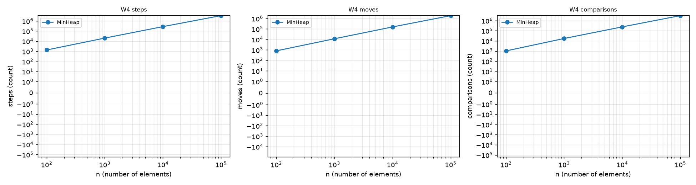
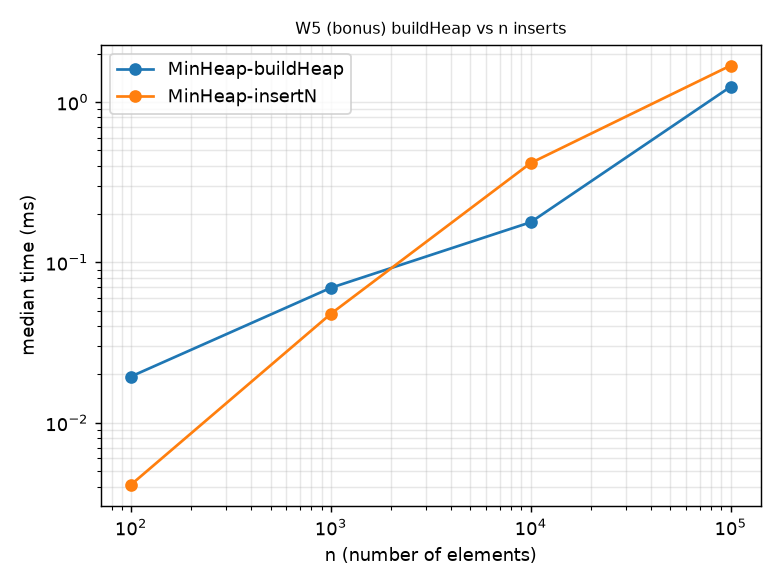
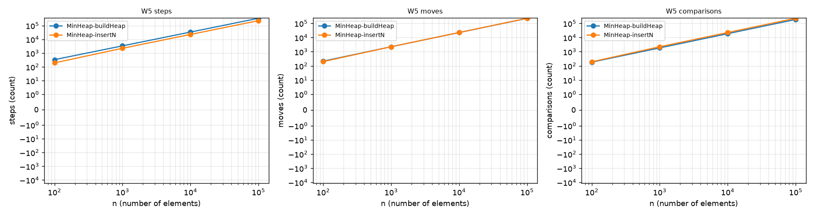

# Assignment 2 - Data Structures: Report

Author: Taubakabyl Nurlybek. Course: Design and Analysis of Algorithms.
All numbers come from `results/results.csv` (seed 42, median of 5 runs after 3 warm-up runs, one JVM, one machine).

## 1. Complexity table

n = current size. `Θ` is used when the bound is tight for that case. Auxiliary space is extra memory beyond the stored data.

### DynamicArray (int[], 2x growth)

| Operation | Best | Average | Worst | Aux. space | Justification |
|---|---|---|---|---|---|
| add(x) | Θ(1) | Θ(1) amortized | Θ(n) single call | O(1) (O(n) during resize) | Write at `size`; a full array is copied once, and doubling makes n appends cost ≤ 3n moves in total. |
| add(i, x) | Θ(1) (i = size) | Θ(n) | Θ(n) (i = 0) | O(1) | Shifts `size - i` elements; the average position is in the middle. |
| remove(i) | Θ(1) (last) | Θ(n) | Θ(n) (i = 0) | O(1) | Shifts `size - i - 1` elements to the left. |
| get(i) | Θ(1) | Θ(1) | Θ(1) | O(1) | One array read. |
| contains(x) | Θ(1) (first cell) | Θ(n) | Θ(n) (absent) | O(1) | Linear scan; a miss reads all n cells, a hit in a random position about n/2. |

### MyLinkedList (singly linked, head + tail)

| Operation | Best | Average | Worst | Aux. space | Justification |
|---|---|---|---|---|---|
| add(x) | Θ(1) | Θ(1) | Θ(1) | O(1) | Tail pointer: two pointer updates. |
| add(i, x) | Θ(1) (i = 0 or size) | Θ(n) | Θ(n) (i = size-1) | O(1) | Walk to node i-1, then 2 pointer updates. |
| remove(i) | Θ(1) (i = 0) | Θ(n) | Θ(n) (i = size-1) | O(1) | Walk to node i-1, then 1-2 pointer updates. |
| get(i) | Θ(1) (i = 0) | Θ(n) | Θ(n) | O(1) | Exactly i "next" steps (confirmed: W1 steps / 10 000 ≈ n/2). |
| contains(x) | Θ(1) | Θ(n) | Θ(n) (absent) | O(1) | Linear scan, as in the array but through pointers. |

### MinHeap (array-based)

| Operation | Best | Average | Worst | Aux. space | Justification |
|---|---|---|---|---|---|
| insert(x) | Θ(1) (x ≥ parent) | Θ(1) on random data | Θ(log n) | O(1) (O(n) during resize) | Bubble-up climbs at most ⌊log₂ n⌋ levels; a random value usually stops after O(1) levels. |
| peekMin() | Θ(1) | Θ(1) | Θ(1) | O(1) | Reads `a[0]`. |
| extractMin() | Θ(1) (all keys equal) | Θ(log n) | Θ(log n) | O(1) | The former last element is large and normally sinks almost to the bottom (W4: ≈1.8 n log₂ n comparisons in total). |
| buildHeap(arr) (bonus) | Θ(n) | Θ(n) | Θ(n) | O(n) copy | Σ over levels of (nodes at level) × (height) = O(n); measured ≈ 1.9 n comparisons. |

Stored data: DynamicArray and MinHeap Θ(n) ints (up to 2n cells after growth); MyLinkedList Θ(n) node objects.

## 2. Loop invariant proofs

### 2.1 `DynamicArray.contains(x)`

```java
for (int i = 0; i < size; i++) { if (data[i] == x) return true; }
return false;
```

* **Invariant:** before each iteration with index `i` (0 ≤ i ≤ size), `x` does not occur in `data[0..i-1]`.
* **Initialization:** before the first iteration `i = 0`; the range `data[0..-1]` is empty, so the statement is true.
* **Maintenance:** assume the invariant holds before iteration `i` and the iteration runs (`i < size`). If `data[i] == x`, the method returns `true` and the loop does not continue. Otherwise `data[i] != x`, so `x` is not in `data[0..i]`; after `i++` this is exactly the invariant for the next iteration.
* **Termination:** the loop ends either by `return true` (then `data[i] == x`, which is a correct answer), or because `i == size`. In the second case the invariant says `x` is not in `data[0..size-1]`, i.e. in no used cell.
* **Conclusion:** `true` is returned only when a cell equal to `x` was seen, and `false` only when the invariant shows that all `size` cells differ from `x`; the loop ends after `size` iterations, so `contains` is correct and terminates.

### 2.2 `MinHeap.siftDown(start, v)` (the loop of `extractMin` and `buildHeap`)

```java
int i = start;
while (true) {
    int child = 2*i + 1;  if (child >= size) break;
    if (child + 1 < size && a[child+1] < a[child]) child++;   // smaller child
    if (v <= a[child]) break;
    a[i] = a[child];  i = child;                               // move child up, hole goes down
}
a[i] = v;
```
Precondition: the subtrees rooted at the children of `start` are heaps. Let `b` be the array `a` with `b[i] = v` (the hole `i` virtually holds `v`).

* **Invariant:** before each iteration (a) every parent-child pair `(p, c)` inside the subtree of `start` with `p ≠ i` satisfies `b[p] ≤ b[c]`; (b) if `i ≠ start`, then `b[parent(i)] ≤ b[c]` for each child `c` of `i`.
* **Initialization:** `i = start`. Pairs with `p ≠ start` lie inside the two child subtrees, which are heaps by the precondition, so (a) holds. (b) is empty because `i = start`.
* **Maintenance:** suppose the loop does not stop, so `i` has a smaller child `c` with `a[c] < v`. The code moves `a[c]` into position `i` and makes `c` the new hole. Pair `(i, c)`: `a[c]` (now at `i`) `< v` (now virtually at `c`), so it holds. Pair `(i, s)` with `s` the sibling of `c`: `a[c] ≤ a[s]` because `c` is the smaller child. Pair `(parent(i), i)`: the new value at `i` is `a[c]`, and by (b) `b[parent(i)] ≤ a[c]`. All other pairs are unchanged. The only pairs left unchecked are those with parent `c`, the new hole, which is exactly (a) for the new `i`. For (b): the parent of `c` is the old `i`, which now holds `a[c]`, and `a[c] ≤` its children by (a) of the old state (c ≠ old i). The index `i` strictly grows (`child > i`) and stays below `size`, so the loop terminates after at most ⌊log₂ n⌋ iterations.
* **Termination:** the loop stops because (1) `i` has no children, or (2) `v ≤` the smaller child, hence `v ≤` both children. In both cases the pairs with parent `i` are fine, and `a[i] = v` is written. Together with (a), now **every** pair in the subtree of `start` is ordered.
* **Conclusion:** the subtree of `start` is a heap again and contains exactly the same multiset of values (every moved value is written once, `v` is written once), so `extractMin` restores the heap property and `buildHeap` can apply it for `i = n/2-1 … 0` to turn an arbitrary array into a heap.

## 3. Benchmark results

Workloads: W1 10 000 `get(random)`, W2 1 000 `contains` (half hits, half misses), W3 1 000 inserts + 1 000 removes at index 0 / n/2, W4 n inserts + n `extractMin` with order check. Charts (time vs n on top, steps/moves/comparisons vs n below):

| Workload | Time vs n | Steps / moves / comparisons vs n |
|---|---|---|
| W1 Random access |  |  |
| W2 Search |  |  |
| W3 Insert & remove |  |  |
| W4 Priority processing |  |  |
| W5 (bonus B) buildHeap |  |  |

Selected numbers for n = 100 000:

| Case | DynamicArray | MyLinkedList |
|---|---|---|
| W1 time / steps | 0.012 ms / 10 000 | 966 ms / 504 930 938 |
| W2 time / steps | 23.8 ms / 73 835 543 | 164.1 ms / 73 835 043 |
| W3 head time / moves | 47.2 ms / 200 999 000 | 0.044 ms / 3 000 |
| W3 middle time / moves + steps | 29.0 ms / 100 999 000 moves | 162.6 ms / 99 998 000 steps + 3 000 moves |

W4 (MinHeap, n = 100 000): 11.7 ms, 3.06 M comparisons (≈ 1.8 · n log₂ n). Sorted output was verified in every run.

**Bonus B (buildHeap).** For n = 100 000 Floyd's build needs 188 424 comparisons (≈ 1.9 n) and 1.03 ms; n separate inserts of the same random data need 227 662 comparisons (≈ 2.3 n) and 1.42 ms. The gap is small on random data because the *average* insert is O(1); the O(n log n) worst case of repeated inserts appears for sorted-descending input, which was not benchmarked. For n ≤ 10 000 the inserts were even faster in wall-clock time (e.g. 0.27 ms vs 0.46 ms at n = 10 000): buildHeap first copies the array and reads two children per step, which my step counter reflects (338 425 steps vs 227 663), and such short runs are close to timer and JIT noise.

## 4. Discussion

1. In W1, `DynamicArray.get(i)` costs one step, so 10 000 calls cost 10 000 steps for every n, while `MyLinkedList.get(i)` walked about n/2 nodes per call (505 M steps at n = 100 000), a difference of about 80 000 times in time.
2. W2 is the most instructive case: both structures perform the same number of steps and comparisons (73.8 M each at n = 100 000), yet the array needs 23.8 ms and the list 164 ms, about 7 times longer.
3. The array scan costs ≈ 0.32 ns per element: `int[]` stores 4-byte values contiguously, so a 64-byte cache line holds 16 elements, the hardware prefetcher recognises the sequential pattern, and the JIT can unroll the loop.
4. The list costs ≈ 2.2 ns per node because every step is a dependent load (pointer chasing): the address of the next node is unknown until the current node has been read, so the CPU cannot overlap the loads.
5. Each node is a separate object with an object header, the `int` value and a reference (typically 24 bytes on a 64-bit HotSpot JVM with compressed references, against 4 bytes per array element; I did not measure this with JOL), so about six times fewer elements fit into one cache line and the working set exceeds the L1/L2 caches earlier.
6. My list nodes were allocated one after another in the benchmark, so they are mostly neighbours in memory; in a long-running program with interleaved allocations and garbage collection the layout is scattered and the list would be slower still, and its n short-lived objects also put extra work on the garbage collector.
7. W3 shows the opposite trade-off: at the head, the list needs 3 000 pointer updates (0 steps) in about 0.04 ms for every n, while the array shifts 201 M elements (47 ms), so MyLinkedList is better when most updates are at the front and no index access is needed (queues, stacks, undo lists).
8. In the middle the list must first walk to position n/2, which costs about as many steps as the array's shifts (100 M vs 101 M), but a shift is a sequential copy (≈ 0.29 ns per move) and the walk is pointer chasing (≈ 1.6 ns per step), so the array wins by 5.6 times at n = 100 000; for n = 100 the list is still faster (0.10 ms vs 0.29 ms) because the walk is short and the cache is not a problem.
9. This is why equal Big-O (both Θ(n) for a middle insert) does not mean equal running time: the hidden constant depends on memory layout.
10. The linked list wins only when the position is already known (head, tail, or an iterator/node reference), because then no traversal is needed and nothing is shifted.
11. MinHeap is the right choice for priority scheduling: `peekMin` is O(1) and `insert` / `extractMin` are O(log n), so n jobs are processed in about 1.8 n log₂ n comparisons (11.7 ms for n = 100 000), whereas keeping a sorted DynamicArray or scanning the array for the minimum costs Θ(n) per job (Θ(n²) overall).
12. The heap itself is an `int[]`, so its parent-child accesses are index arithmetic in contiguous memory, which is also why it needs no node objects or pointers.
13. A heap does not support fast `contains` or sorted iteration, so it should be used only when the access pattern is "always take the smallest".
14. Limitations: all results come from one machine and one JVM process with a simple warm-up, times below about 0.05 ms are close to timer resolution (e.g. the list head case), and the Task A memory measurement with JOL was not done.
